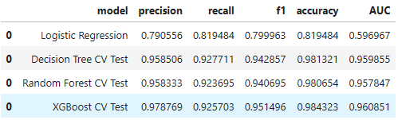

# Data Analytics using Python 
## Overview
**Problem:** High Rate of Employee Turnover  
**Goal:** Create a Machine Learning Model to predict Employee retention

## Python Modules:
1. Pandas
2. Numpy
3. Matplotlib
4. Seaborn
5. Scikit-learn
6. XGBoost

## ML Model Algorithms:
1. Logistic Regression
2. Decision Tree Classifier
3. Random Forest Classifier
4. XGBoost Classifier

## Summary of Results

## Other Links
**Public Dataset Link:** [Dataset](https://www.kaggle.com/datasets/mfaisalqureshi/hr-analytics-and-job-prediction?select=HR_comma_sep.csv)  
**Kaggle:** [Employee Retention Analysis (LogReg - DT/RF/XRG)](https://www.kaggle.com/code/cedricknapa/employee-retention-analysis-logreg-dt-rf-xrg#A.-Planning-Phase)
